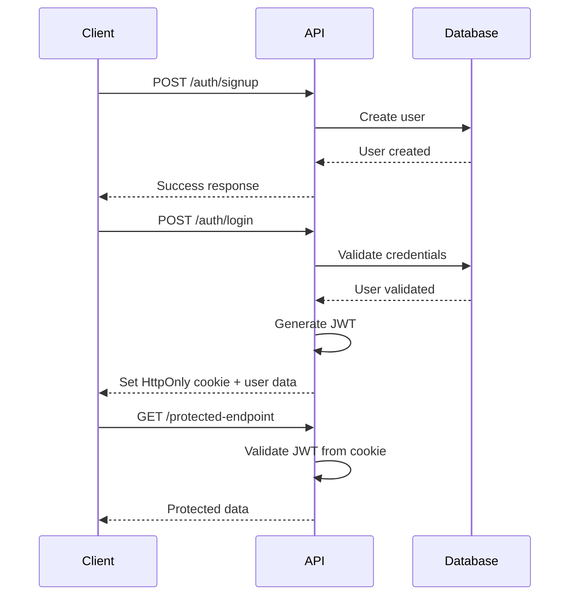

# Complete API Documentation - UIMP Backend

This document provides comprehensive API documentation for the Unified Internship & Mentorship Portal (UIMP) backend, including all endpoints, authentication, error handling, and integration examples.

**Base URL**: `/api`  
**Content-Type**: `application/json` (unless specified otherwise)  
**Authentication**: JWT token in HttpOnly cookie (`auth-token`)  
**API Version**: v1  

---

## Table of Contents

1. [Quick Start Guide](#quick-start-guide)
2. [Authentication](#authentication)
3. [Core APIs](#core-apis)
4. [File Upload APIs](#file-upload-apis)
5. [Dashboard APIs](#dashboard-apis)
6. [Admin APIs](#admin-apis)
7. [Integration Examples](#integration-examples)
8. [SDK and Libraries](#sdk-and-libraries)
9. [Rate Limiting](#rate-limiting)
10. [Webhooks](#webhooks)
11. [Testing Guide](#testing-guide)

---

## Quick Start Guide

### Getting Started in 5 Minutes

1. **Register a new account**:
```bash
curl -X POST http://localhost:3001/api/auth/signup \
  -H "Content-Type: application/json" \
  -d '{
    "email": "student@example.com",
    "password": "SecurePass123!",
    "role": "STUDENT"
  }'
```

2. **Login to get authentication cookie**:
```bash
curl -X POST http://localhost:3001/api/auth/login \
  -H "Content-Type: application/json" \
  -c cookies.txt \
  -d '{
    "email": "student@example.com",
    "password": "SecurePass123!"
  }'
```

3. **Create your first application**:
```bash
curl -X POST http://localhost:3001/api/applications \
  -H "Content-Type: application/json" \
  -b cookies.txt \
  -d '{
    "company": "Tech Corp",
    "role": "Software Engineer Intern",
    "platform": "LINKEDIN",
    "status": "APPLIED"
  }'
```

4. **Get your applications**:
```bash
curl -X GET http://localhost:3001/api/applications \
  -H "Content-Type: application/json" \
  -b cookies.txt
```

### Environment Setup

```bash
# Development
API_BASE_URL=http://localhost:3001/api

# Production
API_BASE_URL=https://api.uimp.com/api
```

---

## Authentication

### Overview

UIMP uses JWT-based authentication with HttpOnly cookies for security. All protected endpoints require a valid JWT token.

### Authentication Flow



### Endpoints

#### POST /api/auth/signup

Register a new user account.

**Request:**
```json
{
  "email": "student@example.com",
  "password": "SecurePass123!",
  "role": "STUDENT"
}
```

**Validation Rules:**
- Email: Valid email format, unique in system
- Password: Minimum 8 characters, must contain letters and numbers
- Role: One of `STUDENT`, `MENTOR`, `ADMIN`

**Response (201 Created):**
```json
{
  "success": true,
  "data": {
    "user": {
      "id": "550e8400-e29b-41d4-a716-446655440000",
      "email": "student@example.com",
      "role": "STUDENT",
      "createdAt": "2024-01-15T10:30:00Z"
    }
  },
  "message": "User created successfully"
}
```

**Error Responses:**
```json
// 409 Conflict - Email already exists
{
  "success": false,
  "error": {
    "code": "DUPLICATE_EMAIL",
    "message": "Email already exists"
  }
}

// 422 Validation Error
{
  "success": false,
  "error": {
    "code": "VALIDATION_ERROR",
    "message": "Validation failed",
    "details": {
      "email": ["Invalid email format"],
      "password": ["Password must be at least 8 characters"]
    }
  }
}
```

#### POST /api/auth/login

Authenticate user and receive JWT token.

**Request:**
```json
{
  "email": "student@example.com",
  "password": "SecurePass123!"
}
```

**Response (200 OK):**
```json
{
  "success": true,
  "data": {
    "user": {
      "id": "550e8400-e29b-41d4-a716-446655440000",
      "email": "student@example.com",
      "role": "STUDENT"
    }
  },
  "message": "Login successful"
}
```

**Cookies Set:**
```
Set-Cookie: auth-token=eyJhbGciOiJIUzI1NiIsInR5cCI6IkpXVCJ9...; 
HttpOnly; Secure; SameSite=Strict; Max-Age=86400; Path=/
```

**Error Responses:**
```json
// 401 Unauthorized - Invalid credentials
{
  "success": false,
  "error": {
    "code": "INVALID_CREDENTIALS",
    "message": "Invalid email or password"
  }
}
```

#### POST /api/auth/logout

Logout current user and clear session.

**Request:** No body required

**Response (200 OK):**
```json
{
  "success": true,
  "message": "Logged out successfully"
}
```

**Cookies Cleared:**
```
Set-Cookie: auth-token=; HttpOnly; Secure; SameSite=Strict; Max-Age=0; Path=/
```

#### GET /api/auth/me

Get current authenticated user information.

**Response (200 OK):**
```json
{
  "success": true,
  "data": {
    "user": {
      "id": "550e8400-e29b-41d4-a716-446655440000",
      "email": "student@example.com",
      "role": "STUDENT",
      "createdAt": "2024-01-15T10:30:00Z",
      "updatedAt": "2024-01-15T10:30:00Z"
    }
  }
}
```

---

## Core APIs

### Applications API

#### GET /api/applications

List internship applications with filtering and pagination.

**Query Parameters:**
```
status: DRAFT | APPLIED | SHORTLISTED | INTERVIEW | OFFER | REJECTED
page: number (default: 1)
limit: number (default: 10, max: 100)
company: string (partial match)
sortBy: createdAt | updatedAt | company | deadline
sortOrder: asc | desc (default: desc)
```

**Example Request:**
```bash
GET /api/applications?status=APPLIED&page=1&limit=20&sortBy=deadline&sortOrder=asc
```

**Response (200 OK):**
```json
{
  "success": true,
  "data": {
    "applications": [
      {
        "id": "660e8400-e29b-41d4-a716-446655440000",
        "userId": "550e8400-e29b-41d4-a716-446655440000",
        "company": "Tech Corp",
        "role": "Software Engineer Intern",
        "platform": "LINKEDIN",
        "status": "APPLIED",
        "resumeUrl": "https://s3.amazonaws.com/bucket/resume.pdf",
        "notes": "Applied through LinkedIn referral",
        "deadline": "2024-02-15T00:00:00Z",
        "createdAt": "2024-01-15T10:30:00Z",
        "updatedAt": "2024-01-16T14:20:00Z",
        "feedbackCount": 2
      }
    ],
    "pagination": {
      "page": 1,
      "limit": 20,
      "total": 25,
      "totalPages": 2,
      "hasNext": true,
      "hasPrev": false
    }
  }
}
```

#### POST /api/applications

Create a new internship application.

**Request:**
```json
{
  "company": "Tech Corp",
  "role": "Software Engineer Intern",
  "platform": "LINKEDIN",
  "status": "DRAFT",
  "resumeUrl": "https://s3.amazonaws.com/bucket/resume.pdf",
  "notes": "Found through LinkedIn job posting",
  "deadline": "2024-02-15T00:00:00Z"
}
```

**Validation Rules:**
- company: Required, max 255 characters
- role: Required, max 255 characters
- platform: Required, one of enum values
- status: Optional, defaults to DRAFT
- resumeUrl: Optional, valid URL
- notes: Optional, max 5000 characters
- deadline: Optional, valid ISO 8601 date

**Response (201 Created):**
```json
{
  "success": true,
  "data": {
    "application": {
      "id": "660e8400-e29b-41d4-a716-446655440000",
      "userId": "550e8400-e29b-41d4-a716-446655440000",
      "company": "Tech Corp",
      "role": "Software Engineer Intern",
      "platform": "LINKEDIN",
      "status": "DRAFT",
      "resumeUrl": "https://s3.amazonaws.com/bucket/resume.pdf",
      "notes": "Found through LinkedIn job posting",
      "deadline": "2024-02-15T00:00:00Z",
      "createdAt": "2024-01-15T10:30:00Z",
      "updatedAt": "2024-01-15T10:30:00Z"
    }
  },
  "message": "Application created successfully"
}
```

#### GET /api/applications/:id

Get a specific application with feedback.

**Path Parameters:**
- id: UUID of the application

**Response (200 OK):**
```json
{
  "success": true,
  "data": {
    "application": {
      "id": "660e8400-e29b-41d4-a716-446655440000",
      "userId": "550e8400-e29b-41d4-a716-446655440000",
      "company": "Tech Corp",
      "role": "Software Engineer Intern",
      "platform": "LINKEDIN",
      "status": "APPLIED",
      "resumeUrl": "https://s3.amazonaws.com/bucket/resume.pdf",
      "notes": "Applied through LinkedIn referral",
      "deadline": "2024-02-15T00:00:00Z",
      "createdAt": "2024-01-15T10:30:00Z",
      "updatedAt": "2024-01-16T14:20:00Z",
      "feedback": [
        {
          "id": "770e8400-e29b-41d4-a716-446655440000",
          "mentorId": "880e8400-e29b-41d4-a716-446655440000",
          "mentor": {
            "id": "880e8400-e29b-41d4-a716-446655440000",
            "email": "mentor@example.com"
          },
          "content": "Great resume! Consider adding more projects.",
          "tags": ["RESUME"],
          "priority": "MEDIUM",
          "createdAt": "2024-01-16T09:00:00Z"
        }
      ]
    }
  }
}
```

#### PUT /api/applications/:id

Update an existing application.

**Request (partial update):**
```json
{
  "status": "SHORTLISTED",
  "notes": "Updated notes after interview"
}
```

**Response (200 OK):**
```json
{
  "success": true,
  "data": {
    "application": {
      // Updated application object
    }
  },
  "message": "Application updated successfully"
}
```

#### DELETE /api/applications/:id

Delete an application.

**Response (200 OK):**
```json
{
  "success": true,
  "message": "Application deleted successfully"
}
```

### Feedback API

#### GET /api/feedback

List feedback entries with filtering.

**Query Parameters:**
```
applicationId: UUID (filter by application)
mentorId: UUID (filter by mentor)
priority: LOW | MEDIUM | HIGH
tags: comma-separated list (RESUME,DSA,SYSTEM_DESIGN,COMMUNICATION)
page: number (default: 1)
limit: number (default: 10, max: 100)
```

**Response (200 OK):**
```json
{
  "success": true,
  "data": {
    "feedback": [
      {
        "id": "770e8400-e29b-41d4-a716-446655440000",
        "applicationId": "660e8400-e29b-41d4-a716-446655440000",
        "mentorId": "880e8400-e29b-41d4-a716-446655440000",
        "mentor": {
          "id": "880e8400-e29b-41d4-a716-446655440000",
          "email": "mentor@example.com"
        },
        "application": {
          "id": "660e8400-e29b-41d4-a716-446655440000",
          "company": "Tech Corp",
          "role": "Software Engineer Intern"
        },
        "content": "Your resume looks good overall. Consider adding more details about your projects and their impact.",
        "tags": ["RESUME", "COMMUNICATION"],
        "priority": "MEDIUM",
        "createdAt": "2024-01-16T09:00:00Z",
        "updatedAt": "2024-01-16T09:00:00Z"
      }
    ],
    "pagination": {
      "page": 1,
      "limit": 10,
      "total": 15,
      "totalPages": 2,
      "hasNext": true,
      "hasPrev": false
    }
  }
}
```

#### POST /api/feedback

Create new feedback for an application (Mentors only).

**Request:**
```json
{
  "applicationId": "660e8400-e29b-41d4-a716-446655440000",
  "content": "Great progress! Your DSA skills have improved significantly. Focus on system design concepts next.",
  "tags": ["DSA", "SYSTEM_DESIGN"],
  "priority": "HIGH"
}
```

**Validation Rules:**
- applicationId: Required, valid UUID, application must exist
- content: Required, max 5000 characters
- tags: Required array, at least one tag, valid enum values
- priority: Required, one of LOW/MEDIUM/HIGH

**Response (201 Created):**
```json
{
  "success": true,
  "data": {
    "feedback": {
      "id": "770e8400-e29b-41d4-a716-446655440000",
      "applicationId": "660e8400-e29b-41d4-a716-446655440000",
      "mentorId": "880e8400-e29b-41d4-a716-446655440000",
      "content": "Great progress! Your DSA skills have improved significantly. Focus on system design concepts next.",
      "tags": ["DSA", "SYSTEM_DESIGN"],
      "priority": "HIGH",
      "createdAt": "2024-01-16T09:00:00Z",
      "updatedAt": "2024-01-16T09:00:00Z"
    }
  },
  "message": "Feedback created successfully"
}
```

**Side Effects:**
- Creates in-app notification for student
- Sends email notification to student
- Updates application's last activity timestamp

---

## File Upload APIs

### Resume Upload

#### POST /api/upload/resume

Upload a resume file.

**Content-Type:** `multipart/form-data`

**Request:**
```bash
curl -X POST http://localhost:3001/api/upload/resume \
  -H "Content-Type: multipart/form-data" \
  -b cookies.txt \
  -F "resume=@/path/to/resume.pdf"
```

**Validation:**
- File type: PDF only
- File size: Maximum 5MB
- File name: Alphanumeric characters and common symbols only

**Response (200 OK):**
```json
{
  "success": true,
  "data": {
    "url": "https://s3.amazonaws.com/uimp-resumes/550e8400-e29b-41d4-a716-446655440000/resume-1642248600.pdf",
    "filename": "resume.pdf",
    "size": 1048576,
    "uploadedAt": "2024-01-15T10:30:00Z"
  },
  "message": "Resume uploaded successfully"
}
```

**Error Responses:**
```json
// 400 Bad Request - Invalid file type
{
  "success": false,
  "error": {
    "code": "INVALID_FILE_TYPE",
    "message": "Only PDF files are allowed"
  }
}

// 413 Payload Too Large
{
  "success": false,
  "error": {
    "code": "FILE_TOO_LARGE",
    "message": "File size exceeds 5MB limit"
  }
}
```

#### GET /api/upload/resume/:filename

Download a resume file.

**Response:** Binary PDF file with appropriate headers

**Headers:**
```
Content-Type: application/pdf
Content-Disposition: attachment; filename="resume.pdf"
Cache-Control: private, max-age=3600
```

---

## Dashboard APIs

### GET /api/dashboard/stats

Get dashboard statistics for the current user.

**Response (200 OK):**

**For Students:**
```json
{
  "success": true,
  "data": {
    "stats": {
      "totalApplications": 25,
      "applicationsByStatus": {
        "DRAFT": 2,
        "APPLIED": 15,
        "SHORTLISTED": 5,
        "INTERVIEW": 2,
        "OFFER": 1,
        "REJECTED": 0
      },
      "recentFeedback": 3,
      "upcomingDeadlines": 2,
      "successRate": 0.32
    },
    "recentApplications": [
      {
        "id": "660e8400-e29b-41d4-a716-446655440000",
        "company": "Tech Corp",
        "role": "Software Engineer Intern",
        "status": "APPLIED",
        "createdAt": "2024-01-15T10:30:00Z"
      }
    ],
    "upcomingDeadlines": [
      {
        "id": "660e8400-e29b-41d4-a716-446655440000",
        "company": "Google",
        "role": "SWE Intern",
        "deadline": "2024-02-01T00:00:00Z",
        "daysLeft": 5
      }
    ]
  }
}
```

**For Mentors:**
```json
{
  "success": true,
  "data": {
    "stats": {
      "totalStudents": 12,
      "totalFeedback": 45,
      "avgResponseTime": 24, // hours
      "studentsWithRecentActivity": 8
    },
    "recentFeedback": [
      {
        "id": "770e8400-e29b-41d4-a716-446655440000",
        "studentEmail": "student@example.com",
        "company": "Tech Corp",
        "priority": "HIGH",
        "createdAt": "2024-01-16T09:00:00Z"
      }
    ],
    "pendingReviews": [
      {
        "applicationId": "660e8400-e29b-41d4-a716-446655440000",
        "studentEmail": "student@example.com",
        "company": "Google",
        "submittedAt": "2024-01-15T10:30:00Z"
      }
    ]
  }
}
```

### GET /api/dashboard/analytics

Get detailed analytics (Mentors and Admins only).

**Query Parameters:**
```
period: 7d | 30d | 90d | 1y (default: 30d)
```

**Response (200 OK):**
```json
{
  "success": true,
  "data": {
    "period": "30d",
    "applicationTrends": [
      {
        "date": "2024-01-01",
        "applications": 5,
        "feedback": 12
      }
    ],
    "statusDistribution": {
      "APPLIED": 45,
      "SHORTLISTED": 20,
      "INTERVIEW": 15,
      "OFFER": 10,
      "REJECTED": 10
    },
    "topCompanies": [
      {
        "company": "Google",
        "applications": 25,
        "successRate": 0.4
      }
    ]
  }
}
```

---

## Admin APIs

### GET /api/admin/users

List all users (Admin only).

**Query Parameters:**
```
role: STUDENT | MENTOR | ADMIN
status: ACTIVE | INACTIVE
page: number (default: 1)
limit: number (default: 20, max: 100)
search: string (search by email)
```

**Response (200 OK):**
```json
{
  "success": true,
  "data": {
    "users": [
      {
        "id": "550e8400-e29b-41d4-a716-446655440000",
        "email": "student@example.com",
        "role": "STUDENT",
        "status": "ACTIVE",
        "createdAt": "2024-01-15T10:30:00Z",
        "lastLoginAt": "2024-01-17T08:15:00Z",
        "applicationCount": 25,
        "feedbackCount": 8
      }
    ],
    "pagination": {
      "page": 1,
      "limit": 20,
      "total": 150,
      "totalPages": 8,
      "hasNext": true,
      "hasPrev": false
    }
  }
}
```

### POST /api/admin/users/:id/status

Update user status (Admin only).

**Request:**
```json
{
  "status": "INACTIVE",
  "reason": "Account suspended for policy violation"
}
```

**Response (200 OK):**
```json
{
  "success": true,
  "message": "User status updated successfully"
}
```

### GET /api/admin/platform-stats

Get platform-wide statistics (Admin only).

**Response (200 OK):**
```json
{
  "success": true,
  "data": {
    "users": {
      "total": 1250,
      "students": 1000,
      "mentors": 200,
      "admins": 50,
      "activeToday": 150
    },
    "applications": {
      "total": 15000,
      "thisMonth": 1200,
      "successRate": 0.28
    },
    "feedback": {
      "total": 8500,
      "thisMonth": 650,
      "avgResponseTime": 18 // hours
    },
    "growth": {
      "userGrowthRate": 0.15, // 15% monthly
      "applicationGrowthRate": 0.22
    }
  }
}
```

---

## Integration Examples

### JavaScript/TypeScript Client

```typescript
// api-client.ts
class UIMPApiClient {
  private baseURL: string;

  constructor(baseURL: string = 'http://localhost:3001/api') {
    this.baseURL = baseURL;
  }

  private async request<T>(
    endpoint: string,
    options: RequestInit = {}
  ): Promise<T> {
    const response = await fetch(`${this.baseURL}${endpoint}`, {
      credentials: 'include',
      headers: {
        'Content-Type': 'application/json',
        ...options.headers,
      },
      ...options,
    });

    if (!response.ok) {
      const error = await response.json();
      throw new Error(error.error?.message || 'Request failed');
    }

    return response.json();
  }

  // Authentication
  async login(email: string, password: string) {
    return this.request('/auth/login', {
      method: 'POST',
      body: JSON.stringify({ email, password }),
    });
  }

  async logout() {
    return this.request('/auth/logout', { method: 'POST' });
  }

  // Applications
  async getApplications(filters?: {
    status?: string;
    page?: number;
    limit?: number;
  }) {
    const params = new URLSearchParams();
    if (filters) {
      Object.entries(filters).forEach(([key, value]) => {
        if (value !== undefined) {
          params.append(key, String(value));
        }
      });
    }

    return this.request(`/applications?${params.toString()}`);
  }

  async createApplication(data: {
    company: string;
    role: string;
    platform: string;
    status?: string;
    notes?: string;
    deadline?: string;
  }) {
    return this.request('/applications', {
      method: 'POST',
      body: JSON.stringify(data),
    });
  }

  // File Upload
  async uploadResume(file: File) {
    const formData = new FormData();
    formData.append('resume', file);

    return fetch(`${this.baseURL}/upload/resume`, {
      method: 'POST',
      credentials: 'include',
      body: formData,
    }).then(res => res.json());
  }
}

// Usage
const client = new UIMPApiClient();

// Login
await client.login('student@example.com', 'password123');

// Create application
const application = await client.createApplication({
  company: 'Google',
  role: 'Software Engineer Intern',
  platform: 'LINKEDIN',
  status: 'APPLIED'
});

// Upload resume
const fileInput = document.getElementById('resume') as HTMLInputElement;
if (fileInput.files?.[0]) {
  await client.uploadResume(fileInput.files[0]);
}
```

### Python Client

```python
# uimp_client.py
import requests
from typing import Optional, Dict, Any

class UIMPClient:
    def __init__(self, base_url: str = "http://localhost:3001/api"):
        self.base_url = base_url
        self.session = requests.Session()
    
    def _request(self, method: str, endpoint: str, **kwargs) -> Dict[Any, Any]:
        url = f"{self.base_url}{endpoint}"
        response = self.session.request(method, url, **kwargs)
        
        if not response.ok:
            error_data = response.json()
            raise Exception(error_data.get('error', {}).get('message', 'Request failed'))
        
        return response.json()
    
    def login(self, email: str, password: str) -> Dict[Any, Any]:
        return self._request('POST', '/auth/login', json={
            'email': email,
            'password': password
        })
    
    def get_applications(self, status: Optional[str] = None, 
                        page: int = 1, limit: int = 10) -> Dict[Any, Any]:
        params = {'page': page, 'limit': limit}
        if status:
            params['status'] = status
        
        return self._request('GET', '/applications', params=params)
    
    def create_application(self, company: str, role: str, 
                          platform: str, **kwargs) -> Dict[Any, Any]:
        data = {
            'company': company,
            'role': role,
            'platform': platform,
            **kwargs
        }
        return self._request('POST', '/applications', json=data)

# Usage
client = UIMPClient()

# Login
client.login('student@example.com', 'password123')

# Get applications
applications = client.get_applications(status='APPLIED')

# Create new application
new_app = client.create_application(
    company='Google',
    role='Software Engineer Intern',
    platform='LINKEDIN'
)
```

### React Hook Example

```typescript
// hooks/useApplications.ts
import { useState, useEffect } from 'react';
import { UIMPApiClient } from '../lib/api-client';

interface Application {
  id: string;
  company: string;
  role: string;
  status: string;
  createdAt: string;
}

interface UseApplicationsResult {
  applications: Application[];
  loading: boolean;
  error: string | null;
  createApplication: (data: any) => Promise<void>;
  updateApplication: (id: string, data: any) => Promise<void>;
  deleteApplication: (id: string) => Promise<void>;
  refetch: () => Promise<void>;
}

export function useApplications(): UseApplicationsResult {
  const [applications, setApplications] = useState<Application[]>([]);
  const [loading, setLoading] = useState(true);
  const [error, setError] = useState<string | null>(null);
  
  const client = new UIMPApiClient();

  const fetchApplications = async () => {
    try {
      setLoading(true);
      setError(null);
      const response = await client.getApplications();
      setApplications(response.data.applications);
    } catch (err) {
      setError(err instanceof Error ? err.message : 'Failed to fetch applications');
    } finally {
      setLoading(false);
    }
  };

  const createApplication = async (data: any) => {
    try {
      await client.createApplication(data);
      await fetchApplications(); // Refetch to get updated list
    } catch (err) {
      throw new Error(err instanceof Error ? err.message : 'Failed to create application');
    }
  };

  const updateApplication = async (id: string, data: any) => {
    try {
      await client.updateApplication(id, data);
      await fetchApplications();
    } catch (err) {
      throw new Error(err instanceof Error ? err.message : 'Failed to update application');
    }
  };

  const deleteApplication = async (id: string) => {
    try {
      await client.deleteApplication(id);
      await fetchApplications();
    } catch (err) {
      throw new Error(err instanceof Error ? err.message : 'Failed to delete application');
    }
  };

  useEffect(() => {
    fetchApplications();
  }, []);

  return {
    applications,
    loading,
    error,
    createApplication,
    updateApplication,
    deleteApplication,
    refetch: fetchApplications,
  };
}

// Usage in component
function ApplicationsList() {
  const { 
    applications, 
    loading, 
    error, 
    createApplication 
  } = useApplications();

  if (loading) return <div>Loading...</div>;
  if (error) return <div>Error: {error}</div>;

  return (
    <div>
      {applications.map(app => (
        <div key={app.id}>
          {app.company} - {app.role} ({app.status})
        </div>
      ))}
    </div>
  );
}
```

---

## SDK and Libraries

### Official SDKs

**JavaScript/TypeScript SDK:**
```bash
npm install @uimp/sdk
```

**Python SDK:**
```bash
pip install uimp-python-sdk
```

**Usage:**
```typescript
import { UIMP } from '@uimp/sdk';

const uimp = new UIMP({
  apiUrl: 'https://api.uimp.com',
  // API key for server-to-server communication
  apiKey: process.env.UIMP_API_KEY
});

// All methods return promises
const applications = await uimp.applications.list();
const newApp = await uimp.applications.create({
  company: 'Google',
  role: 'SWE Intern'
});
```

### Community Libraries

- **uimp-react**: React components and hooks
- **uimp-vue**: Vue.js composables
- **uimp-angular**: Angular services and components

---

## Rate Limiting

### Rate Limit Rules

| Endpoint Category | Limit | Window |
|------------------|-------|---------|
| Authentication | 5 requests | 15 minutes |
| General API | 100 requests | 1 minute |
| File Upload | 10 requests | 1 hour |
| Admin API | 200 requests | 1 minute |

### Rate Limit Headers

All responses include rate limit information:

```
X-RateLimit-Limit: 100
X-RateLimit-Remaining: 95
X-RateLimit-Reset: 1642248660
X-RateLimit-Window: 60
```

### Handling Rate Limits

```typescript
async function makeRequestWithRetry(requestFn: () => Promise<any>, maxRetries = 3) {
  for (let i = 0; i < maxRetries; i++) {
    try {
      return await requestFn();
    } catch (error) {
      if (error.status === 429) {
        const resetTime = error.headers['x-ratelimit-reset'];
        const waitTime = (resetTime * 1000) - Date.now();
        
        if (i < maxRetries - 1 && waitTime > 0) {
          await new Promise(resolve => setTimeout(resolve, waitTime));
          continue;
        }
      }
      throw error;
    }
  }
}
```

---

## Webhooks

### Webhook Events

UIMP can send webhooks for the following events:

- `application.created`
- `application.updated`
- `application.deleted`
- `feedback.created`
- `feedback.updated`
- `user.registered`

### Webhook Configuration

```bash
# Configure webhook endpoint (Admin only)
POST /api/admin/webhooks
{
  "url": "https://your-app.com/webhooks/uimp",
  "events": ["application.created", "feedback.created"],
  "secret": "your-webhook-secret"
}
```

### Webhook Payload

```json
{
  "event": "application.created",
  "timestamp": "2024-01-15T10:30:00Z",
  "data": {
    "application": {
      "id": "660e8400-e29b-41d4-a716-446655440000",
      "company": "Tech Corp",
      "role": "Software Engineer Intern",
      "status": "APPLIED",
      "userId": "550e8400-e29b-41d4-a716-446655440000"
    }
  }
}
```

### Webhook Verification

```typescript
import crypto from 'crypto';

function verifyWebhook(payload: string, signature: string, secret: string): boolean {
  const expectedSignature = crypto
    .createHmac('sha256', secret)
    .update(payload)
    .digest('hex');
  
  return crypto.timingSafeEqual(
    Buffer.from(signature, 'hex'),
    Buffer.from(expectedSignature, 'hex')
  );
}

// Express.js webhook handler
app.post('/webhooks/uimp', express.raw({ type: 'application/json' }), (req, res) => {
  const signature = req.headers['x-uimp-signature'] as string;
  const payload = req.body.toString();
  
  if (!verifyWebhook(payload, signature, process.env.WEBHOOK_SECRET)) {
    return res.status(401).send('Invalid signature');
  }
  
  const event = JSON.parse(payload);
  console.log('Received webhook:', event.event, event.data);
  
  res.status(200).send('OK');
});
```

---

## Testing Guide

### API Testing with Postman

**Collection Setup:**
1. Import the UIMP Postman collection
2. Set environment variables:
   - `base_url`: API base URL
   - `auth_token`: JWT token (auto-updated by login request)

**Authentication Flow:**
```javascript
// Pre-request script for login
pm.sendRequest({
    url: pm.environment.get("base_url") + "/auth/login",
    method: 'POST',
    header: {
        'Content-Type': 'application/json',
    },
    body: {
        mode: 'raw',
        raw: JSON.stringify({
            email: "test@example.com",
            password: "password123"
        })
    }
}, function (err, response) {
    if (response.code === 200) {
        const cookies = response.headers.get('Set-Cookie');
        pm.environment.set("auth_cookie", cookies);
    }
});
```

### Unit Testing

```typescript
// tests/api/applications.test.ts
import request from 'supertest';
import { app } from '../src/app';
import { createTestUser, getAuthCookie } from './helpers';

describe('Applications API', () => {
  let authCookie: string;
  
  beforeEach(async () => {
    const user = await createTestUser({ role: 'STUDENT' });
    authCookie = await getAuthCookie(user.email, 'password123');
  });

  describe('POST /api/applications', () => {
    it('should create a new application', async () => {
      const applicationData = {
        company: 'Test Corp',
        role: 'Software Engineer',
        platform: 'LINKEDIN',
        status: 'APPLIED'
      };

      const response = await request(app)
        .post('/api/applications')
        .set('Cookie', authCookie)
        .send(applicationData)
        .expect(201);

      expect(response.body.success).toBe(true);
      expect(response.body.data.application.company).toBe('Test Corp');
    });

    it('should validate required fields', async () => {
      const response = await request(app)
        .post('/api/applications')
        .set('Cookie', authCookie)
        .send({})
        .expect(422);

      expect(response.body.success).toBe(false);
      expect(response.body.error.code).toBe('VALIDATION_ERROR');
    });
  });

  describe('GET /api/applications', () => {
    it('should return user applications', async () => {
      // Create test application first
      await request(app)
        .post('/api/applications')
        .set('Cookie', authCookie)
        .send({
          company: 'Test Corp',
          role: 'Software Engineer',
          platform: 'LINKEDIN'
        });

      const response = await request(app)
        .get('/api/applications')
        .set('Cookie', authCookie)
        .expect(200);

      expect(response.body.success).toBe(true);
      expect(response.body.data.applications).toHaveLength(1);
    });
  });
});
```

### Load Testing

```javascript
// k6 load test script
import http from 'k6/http';
import { check, sleep } from 'k6';

export let options = {
  stages: [
    { duration: '2m', target: 100 }, // Ramp up
    { duration: '5m', target: 100 }, // Stay at 100 users
    { duration: '2m', target: 0 },   // Ramp down
  ],
};

export default function () {
  // Login
  let loginResponse = http.post('http://localhost:3001/api/auth/login', 
    JSON.stringify({
      email: 'test@example.com',
      password: 'password123'
    }), 
    {
      headers: { 'Content-Type': 'application/json' },
    }
  );

  check(loginResponse, {
    'login successful': (r) => r.status === 200,
  });

  let cookies = loginResponse.cookies;

  // Get applications
  let appsResponse = http.get('http://localhost:3001/api/applications', {
    cookies: cookies,
  });

  check(appsResponse, {
    'applications retrieved': (r) => r.status === 200,
  });

  sleep(1);
}
```

---

## Error Codes Reference

### Authentication Errors (401, 403)

| Code | Message | Description |
|------|---------|-------------|
| `UNAUTHORIZED` | Authentication required | No valid JWT token provided |
| `INVALID_TOKEN` | Invalid or expired token | JWT token is malformed or expired |
| `FORBIDDEN` | Insufficient permissions | User doesn't have required role |
| `INVALID_CREDENTIALS` | Invalid email or password | Login credentials are incorrect |

### Validation Errors (422)

| Code | Message | Description |
|------|---------|-------------|
| `VALIDATION_ERROR` | Validation failed | Input validation failed |
| `INVALID_EMAIL` | Invalid email format | Email format is incorrect |
| `WEAK_PASSWORD` | Password too weak | Password doesn't meet requirements |
| `INVALID_ENUM` | Invalid enum value | Provided value not in allowed list |

### Resource Errors (404, 409)

| Code | Message | Description |
|------|---------|-------------|
| `NOT_FOUND` | Resource not found | Requested resource doesn't exist |
| `DUPLICATE_EMAIL` | Email already exists | Email is already registered |
| `RESOURCE_NOT_OWNED` | Resource not owned by user | User doesn't own the resource |

### File Upload Errors (400, 413)

| Code | Message | Description |
|------|---------|-------------|
| `INVALID_FILE_TYPE` | Invalid file type | File type not supported |
| `FILE_TOO_LARGE` | File size exceeds limit | File exceeds maximum size |
| `UPLOAD_FAILED` | File upload failed | Generic upload error |

### Server Errors (500)

| Code | Message | Description |
|------|---------|-------------|
| `INTERNAL_ERROR` | Internal server error | Unexpected server error |
| `DATABASE_ERROR` | Database operation failed | Database connection or query error |
| `EXTERNAL_SERVICE_ERROR` | External service unavailable | Third-party service error |

---

## Changelog

### Version 1.2.0 (January 17, 2024)

**New Features:**
- Added dashboard analytics API
- Implemented webhook system
- Added file upload progress tracking
- Enhanced error handling with detailed codes

**Improvements:**
- Optimized query performance for large datasets
- Added comprehensive input validation
- Improved rate limiting granularity
- Enhanced security headers

**Bug Fixes:**
- Fixed pagination edge cases
- Resolved timezone handling issues
- Fixed file upload memory leaks

### Version 1.1.0 (January 10, 2024)

**New Features:**
- Added feedback tagging system
- Implemented application filtering
- Added mentor assignment functionality

**Improvements:**
- Enhanced authentication security
- Improved API response times
- Added request/response logging

### Version 1.0.0 (January 1, 2024)

**Initial Release:**
- Core authentication system
- Application CRUD operations
- Feedback system
- File upload functionality
- Basic dashboard APIs

---

**API Version**: 1.2.0  
**Last Updated**: January 17, 2024  
**Maintained By**: Backend Team (Heramb)  
**Support**: api-support@uimp.com  
**Documentation**: https://docs.uimp.com/api